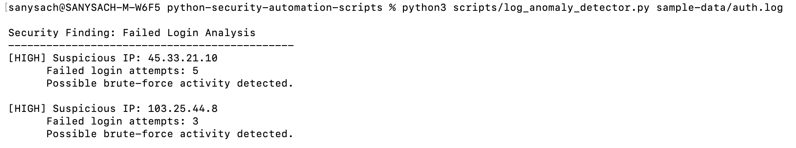
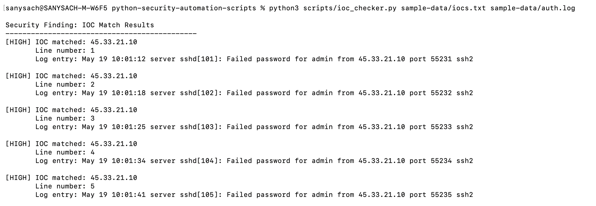
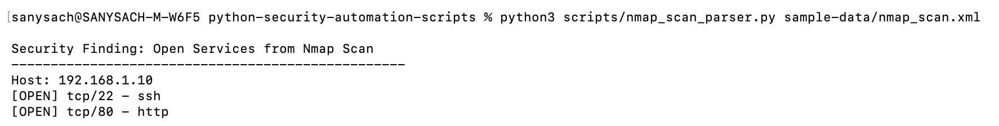
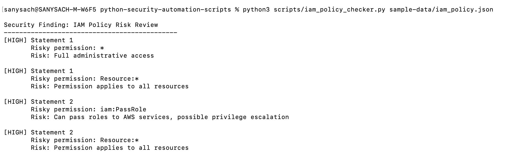

# Python Security Automation Scripts

## Objective

This project contains Python scripts that automate common cybersecurity workflows used by SOC analysts, cloud security engineers, and incident response teams.

The goal is to reduce manual investigation time by parsing logs, detecting suspicious behavior, checking indicators of compromise, reviewing IAM policies, and generating simple security findings.
This lab demonstrates first-level SOC and cloud security triage automation using Python, sample security logs, Nmap scan output, IOC matching, and IAM policy review.

## Project Status

This lab includes working Python scripts for:

- SSH failed-login detection
- IOC matching
- Nmap XML parsing
- IAM policy risk review

Each script includes sample input data and reproducible command-line output.

## Security Concepts Demonstrated

- Brute-force detection
- Indicator of compromise matching
- Attack surface discovery
- Least-privilege IAM review
- First-level SOC triage automation

## Use Cases

- Detect repeated failed login attempts from authentication logs
- Check IP addresses, domains, or hashes against known IOC lists
- Parse Nmap scan results and summarize exposed services
- Review IAM policies for risky permissions
- Generate simple security reports from script outputs

## Tools & Skills Used

- Python
- Linux log analysis
- Nmap XML parsing
- IOC checking
- AWS IAM policy review
- Security automation
- Incident response fundamentals

## Repository Structure

| Folder | Purpose |
|---|---|
| `scripts/` | Python automation scripts |
| `sample-data/` | Sample logs, IOC files, Nmap XML, IAM policies |
| `reports/` | Example generated reports |
| `screenshots/` | Execution screenshots |
| `docs/` | Step-by-step lab documentation |

## Scripts Included

| Script | Purpose |
|---|---|
| `log_anomaly_detector.py` | Detects repeated failed login attempts |
| `ioc_checker.py` | Checks suspicious indicators against a known IOC list |
| `nmap_scan_parser.py` | Parses Nmap XML and extracts open ports/services |
| `iam_policy_checker.py` | Flags risky IAM permissions such as wildcard access |

## Screenshots

### Failed Login Detection



### IOC Checker



### Nmap Parser



### IAM Policy Checker



## How to Run

Run failed login detector:

```bash
python3 scripts/log_anomaly_detector.py sample-data/auth.log
```

Run IOC checker:

```bash
python3 scripts/ioc_checker.py sample-data/iocs.txt sample-data/auth.log
```

Run Nmap parser:

```bash
python3 scripts/nmap_scan_parser.py sample-data/nmap_scan.xml
```

Run IAM policy checker:

```bash
python3 scripts/iam_policy_checker.py sample-data/iam_policy.json
```

## Resume Relevance

This project demonstrates hands-on experience in:

- Security automation
- Incident response triage
- Log analysis
- Cloud IAM risk detection
- Attack surface review
- Python scripting for SOC workflows

## Automated Checks

This repository uses GitHub Actions to automatically check Python syntax and run basic tests whenever code is pushed to the main branch.

The workflow validates:

- Required scripts exist
- Required sample data files exist
- Python files compile successfully
- Basic pytest checks pass
