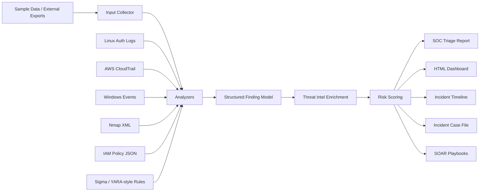

# SOC & Incident Response Automation Toolkit


Python-based SOC triage toolkit that analyzes sample security telemetry, detects suspicious behavior, enriches findings with local threat intelligence, assigns risk scores, and generates analyst-ready reports.

It works offline using sample Linux, Windows, AWS, IAM, Nmap, IOC, Sigma, and YARA-style inputs.
> Built to demonstrate security log analysis, incident response workflow design, detection engineering, and Python automation.

---

## Core Workflow

1. Parse local security telemetry and exported logs.
2. Run analyzers across Linux, Windows, AWS, IAM, Nmap, IOC, Sigma, and YARA-style inputs.
3. Normalize detections into a shared finding model.
4. Enrich findings with local threat intelligence.
5. Apply severity and risk scoring.
6. Generate reports, dashboards, timelines, case files, and playbook recommendations.

---

## Architecture



---

## What This Project Detects

| Area | Detection Examples |
|---|---|
| Linux Auth Logs | SSH brute-force behavior, repeated failed-login sources, successful login correlation |
| IOC Matching | Known malicious or suspicious IPs, domains, and hashes |
| Nmap Exposure | Exposed management, database, and web services |
| IAM Policy Review | Wildcard permissions, resource overexposure, privilege escalation patterns |
| AWS CloudTrail | Root login failure, access-key creation, policy attachment, bucket policy changes |
| Windows Events | Failed logons, encoded PowerShell, account creation, privileged group changes |
| Detection Rules | Sigma-style and YARA-style matches against exported telemetry |

## Live Dashboard
[Open SOC Dashboard](https://sanyasachdeva1.github.io/python-security-automation-scripts/reports/soc_dashboard.html)

---

## Key Features

- Shared finding model with severity, evidence, recommendation, MITRE mapping, and source tracking
- Multi-source SOC triage across Linux, Windows, AWS, IAM, Nmap, IOC, Sigma, and YARA-style data
- Local threat intelligence enrichment
- Risk scoring from 0–100
- Markdown, JSON, HTML dashboard, timeline, case file, and SOAR-style playbook outputs
- Offline-first sample data for easy review
- pytest validation and GitHub Actions CI

---

## Repository Structure

| Folder | Purpose |
|---|---|
| `scripts/` | Python automation scripts and analyzers |
| `sample-data/` | Sample logs, IOC files, Nmap XML, IAM policies, CloudTrail events, Windows events, rules |
| `reports/` | Generated SOC reports, dashboard, timeline, case file, and playbooks |
| `screenshots/` | Execution screenshots |
| `docs/` | Extended usage and documentation |
| `config/` | Optional external input collection examples |
| `tests/` | Pytest-based validation |

---

## Main Scripts

| Script | Purpose |
|---|---|
| `soc_triage.py` | Runs the main SOC triage pipeline |
| `log_anomaly_detector.py` | Detects repeated failed SSH login attempts |
| `ioc_checker.py` | Matches logs against known indicators of compromise |
| `nmap_scan_parser.py` | Parses Nmap XML and flags exposed services |
| `iam_policy_checker.py` | Reviews IAM policies for risky permissions |
| `cloudtrail_analyzer.py` | Detects suspicious AWS CloudTrail events |
| `windows_event_analyzer.py` | Detects suspicious Windows security events |
| `rule_scanner.py` | Runs Sigma and YARA-style detections |
| `incident_timeline.py` | Builds a chronological incident timeline |
| `case_manager.py` | Generates a SOC case file |
| `html_dashboard.py` | Generates an HTML dashboard |
| `threat_intel_enricher.py` | Enriches findings using a local threat-intel feed |
| `risk_scoring.py` | Applies numeric risk scoring |
| `soar_playbooks.py` | Generates response playbook recommendations |
| `input_collector.py` | Collects externalized file exports or URL feeds into normalized inputs |

---

## Quick Demo

Run the complete SOC triage pipeline:

```bash
python3 scripts/soc_triage.py
```

Generate the main portfolio artifacts:

```bash
python3 scripts/soc_triage.py --format markdown --output reports/soc_triage_report.md
python3 scripts/incident_timeline.py --output reports/incident_timeline.md
python3 scripts/case_manager.py --output reports/incident_case.md
python3 scripts/html_dashboard.py --output reports/soc_dashboard.html
python3 scripts/soar_playbooks.py --output reports/soar_playbooks.md
```

Generate machine-readable JSON:

```bash
python3 scripts/soc_triage.py --format json --output reports/soc_triage_report.json
```

---

## Example Output

Expected sample outcome from the provided demo data:

- 20 total findings
- Critical findings for privileged Windows group modification, suspicious AWS IAM policy attachment, and wildcard IAM access
- High-risk detections for encoded PowerShell, CloudTrail access-key creation, SSH brute force, IOC matches, and exposed SSH
- Risk scores from 0–100 to help prioritize analyst response

---

## Report Outputs

| Report | Purpose |
|---|---|
| `reports/soc_triage_report.md` | Prioritized SOC findings with evidence, enrichment, risk scores, and recommendations |
| `reports/soc_dashboard.html` | Browser-friendly dashboard with severity metrics and finding table |
| `reports/incident_timeline.md` | Chronological timeline across Linux, AWS, and Windows telemetry |
| `reports/incident_case.md` | Case-management style incident record with checklist |
| `reports/soar_playbooks.md` | Suggested response playbooks mapped to triggered findings |

---

## Data Sources

This project is offline-first. It does not call AWS, VirusTotal, AbuseIPDB, or any external API by default.

All demo input data lives in `sample-data/`, including:

- Linux auth logs
- CloudTrail-like records
- Windows event records
- IOC lists
- IAM policy JSON
- Nmap XML
- Sigma rules
- YARA-style rules
- Local threat intelligence feed

Optional live or exported integrations can be added through the collector workflow without changing the analyzer and reporting logic.

---

## Documentation

Extended documentation is available in:

| Document | Purpose |
|---|---|
| `docs/external_data_sources.md` | Optional collector workflow and external input examples |
| `docs/lab_steps.md` | Step-by-step lab execution guide |

---

## Tests and CI

Run local tests:

```bash
pytest
```

This repository uses GitHub Actions to validate Python syntax and run tests on every push and pull request.

The workflow validates:

- Required scripts and sample data exist
- Python files compile successfully
- Analyzer behavior and finding structure
- Basic pytest checks pass

---

## Production Extension Path
This project could be extended with collectors for:
- SIEM exports from Splunk, Sentinel, Elastic, or QRadar
- EDR exports from Defender, CrowdStrike, SentinelOne, or osquery
- AWS CloudTrail from S3, CloudWatch Logs, or AWS APIs
- Threat intelligence APIs such as VirusTotal, AbuseIPDB, GreyNoise, OTX, or MISP
- Ticketing systems such as Jira, ServiceNow, TheHive, or GitHub Issues
  
---

## Resume Relevance

This project demonstrates hands-on experience in:

- SOC triage automation
- Incident response workflow design
- Security log analysis
- IOC matching and enrichment
- MITRE ATT&CK mapping
- Risk scoring
- Report generation
- Python-based security tooling
- GitHub Actions CI

---

## What Makes This Different

Unlike single-purpose SOC scripts, this project connects multiple parts of the incident response workflow:

- Multi-source triage across Linux auth logs, AWS CloudTrail, Windows events, IAM policies, Nmap XML, IOCs, Sigma-style rules, and YARA-style rules
- Offline-first design with realistic sample data, so the project can be reviewed without cloud credentials or paid APIs
- Shared structured `Finding` model across analyzers for consistent evidence, severity, MITRE mapping, recommendations, enrichment, and risk scoring
- Analyst-ready outputs including a dashboard, Markdown report, JSON report, incident timeline, case file, and SOAR playbooks
- Future-ready collector layer for external SIEM, EDR, cloud, and threat-intel sources
- Portfolio-friendly balance: broad enough to show SOC/IR thinking, but not overloaded into a full SIEM platform

---

## Disclaimer

This project is designed for educational and defensive security purposes only. It uses safe sample data and does not interact with production systems, external APIs, or live environments by default.

Only analyze logs, indicators, or exported telemetry that you own or are authorized to review.
