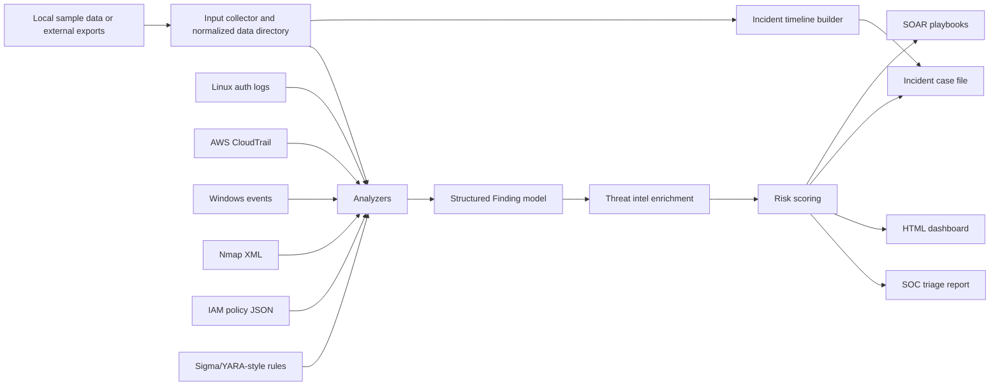

# SOC & Incident Response Automation Toolkit


## Objective

This project contains Python scripts that automate common cybersecurity workflows used by SOC analysts, cloud security engineers, and incident response teams.

The goal is to reduce manual investigation time by parsing logs, detecting suspicious behavior, checking indicators of compromise, reviewing IAM policies, and generating prioritized security findings.
This lab demonstrates first-level SOC and cloud security triage automation using Python, sample security logs, Nmap scan output, IOC matching, and IAM policy review.

## Executive Summary

This project simulates a small SOC automation pipeline. It collects normalized security telemetry, runs multiple analyzers, enriches findings with local threat intelligence, applies a numeric risk score, maps activity to MITRE ATT&CK, and generates analyst-ready outputs such as reports, dashboards, incident timelines, case files, and SOAR-style playbooks.

The project is intentionally offline-first so it can be cloned, tested, and demonstrated without cloud credentials, paid APIs, or sensitive production logs. At the same time, it includes an optional collector layer so future AWS, SIEM, EDR, threat-intel, or URL-based feeds can be normalized into the same workflow.

## Live Dashboard

View the published SOC dashboard:

[Open SOC Dashboard](https://sanyasachdeva1.github.io/python-security-automation-scripts/reports/soc_dashboard.html)

## Project Status

This lab includes working Python scripts for:

- SSH failed-login detection
- IOC matching
- Nmap XML parsing
- IAM policy risk review
- Combined SOC triage reporting
- AWS CloudTrail security analysis
- Windows Event Log security analysis
- Incident timeline and case file generation
- Sigma and YARA-style rule scanning
- HTML dashboard reporting
- Local threat intelligence enrichment
- Numeric risk scoring
- SOAR-style response playbook recommendations
- Optional external input collection layer
- JSON and Markdown report output
- MITRE ATT&CK technique mapping
- Severity-based finding prioritization

Each script includes sample input data and reproducible command-line output.

## Architecture



## What This Project Detects

- SSH brute-force behavior and repeated failed-login sources
- Known IOC matches in logs
- Risky exposed services from Nmap XML
- AWS IAM wildcard permissions and privilege escalation patterns
- AWS CloudTrail activity such as root login failure, access-key creation, policy attachment, and bucket policy changes
- Windows failed logons, encoded PowerShell, local/domain account creation, and privileged group membership changes
- Sigma-style detections for suspicious Windows activity
- YARA-style content matches against exported telemetry

## Security Concepts Demonstrated

- Brute-force detection
- Indicator of compromise matching
- Attack surface discovery
- Least-privilege IAM review
- First-level SOC triage automation

## Use Cases

- Detect repeated failed login attempts from authentication logs
- Check IP addresses, domains, or hashes against known IOC lists
- Parse Nmap scan results and summarize exposed services
- Review IAM policies for risky permissions
- Generate simple security reports from script outputs
- Produce machine-readable JSON for SIEM/SOAR handoff
- Produce Markdown reports for analyst notes or case documentation
- Build incident timelines from Linux, AWS, and Windows telemetry
- Generate case-management output for incident handling
- Scan sample telemetry with simple Sigma and YARA-style rules
- Enrich indicators with a local threat-intelligence feed
- Prioritize findings using a 0-100 risk score
- Generate playbook-driven response actions
- Collect future external logs, feeds, and exports into the same analyzer format

## Tools & Skills Used

- Python
- Linux log analysis
- Nmap XML parsing
- IOC checking
- AWS IAM policy review
- AWS CloudTrail triage
- Windows Event Log triage
- Sigma/YARA-style detection logic
- Threat intelligence enrichment
- Risk scoring
- SOAR playbook design
- Security automation
- Incident response fundamentals

## Repository Structure

| Folder | Purpose |
|---|---|
| `scripts/` | Python automation scripts |
| `sample-data/` | Sample logs, IOC files, Nmap XML, IAM policies |
| `reports/` | Example generated reports |
| `screenshots/` | Execution screenshots |
| `docs/` | Step-by-step lab documentation |
| `config/` | Optional external input collection examples |

## Scripts Included

| Script | Purpose |
|---|---|
| `log_anomaly_detector.py` | Detects repeated failed login attempts |
| `ioc_checker.py` | Checks suspicious indicators against a known IOC list |
| `nmap_scan_parser.py` | Parses Nmap XML and extracts open ports/services |
| `iam_policy_checker.py` | Flags risky IAM permissions such as wildcard access |
| `soc_triage.py` | Runs all analyzers and generates a prioritized SOC report |
| `soc_common.py` | Shared finding, severity, and reporting helpers |
| `cloudtrail_analyzer.py` | Detects suspicious AWS CloudTrail events |
| `windows_event_analyzer.py` | Detects Windows logon, process, account, and group-change activity |
| `incident_timeline.py` | Builds a chronological incident timeline |
| `rule_scanner.py` | Runs simple Sigma and YARA-style detections |
| `case_manager.py` | Generates an incident case file with checklist |
| `html_dashboard.py` | Generates an HTML dashboard report |
| `threat_intel_enricher.py` | Enriches findings from a local threat intel feed |
| `risk_scoring.py` | Applies numeric risk scores to findings |
| `soar_playbooks.py` | Generates response playbook recommendations |
| `input_collector.py` | Collects externalized input files or URL feeds into normalized data files |

## SOC-Level Features

- Shared `Finding` model with severity, evidence, recommendations, MITRE ATT&CK mapping, and source tracking
- Prioritized triage output sorted by severity
- SSH brute-force detection with targeted-user evidence and successful-login correlation
- IOC matching with indicator type classification and line-level evidence
- Nmap service risk rating for exposed management, database, and web services
- IAM policy review for wildcard access, resource overexposure, `NotAction` risk, and privilege escalation patterns
- CloudTrail detection for root login failures, access-key creation, policy attachment, and bucket policy changes
- Windows detection for brute-force patterns, encoded PowerShell, account creation, and privileged group membership changes
- Incident timeline generation across Linux auth logs, AWS CloudTrail, and Windows events
- Case-management report with severity, key findings, timeline, and response checklist
- Simple Sigma and YARA-style rule support for detection engineering examples
- HTML dashboard with severity metrics and analyst recommendations
- Offline threat intelligence feed for malicious/suspicious IP and domain context
- Risk scoring that combines severity, cloud/endpoint context, successful access, MITRE relevance, and threat-intel confidence
- SOAR-style playbook recommendations for SSH brute force, AWS privilege escalation, Windows compromise, IOC matches, and exposed services
- Optional input collector for externalized file exports and URL-based feeds
- Combined report generation for incident notes, GitHub evidence, and portfolio review

## How to Run

### Quick Demo

Run the complete SOC triage pipeline:

```bash
python3 scripts/soc_triage.py
```

Generate the main portfolio artifacts:
```bash
python3 scripts/soc_triage.py --format markdown --output reports/soc_triage_report.md
python3 scripts/incident_timeline.py --output reports/incident_timeline.md
python3 scripts/case_manager.py --output reports/incident_case.md
python3 scripts/html_dashboard.py --output reports/soc_dashboard.html
python3 scripts/soar_playbooks.py --output reports/soar_playbooks.md
```

Expected sample outcome:
- 20 total findings from the provided sample data
- Critical findings for privileged Windows group modification, suspicious AWS IAM policy attachment, and wildcard IAM access
- High-risk detections for encoded PowerShell, CloudTrail access-key creation, SSH brute force, IOC matches, and exposed SSH
- Risk scores from 0-100 to prioritize analyst response

### Individual Tools

Run failed login detector:

```bash
python3 scripts/log_anomaly_detector.py sample-data/auth.log
```

Run IOC checker:

```bash
python3 scripts/ioc_checker.py sample-data/iocs.txt sample-data/auth.log
```

Run Nmap parser:

```bash
python3 scripts/nmap_scan_parser.py sample-data/nmap_scan.xml
```

Run IAM policy checker:

```bash
python3 scripts/iam_policy_checker.py sample-data/iam_policy.json
```

Run full SOC triage:

```bash
python3 scripts/soc_triage.py
```

Generate a Markdown triage report:

```bash
python3 scripts/soc_triage.py --format markdown --output reports/soc_triage_report.md
```

Generate machine-readable JSON:

```bash
python3 scripts/soc_triage.py --format json --output reports/soc_triage_report.json
```

Run CloudTrail analysis:

```bash
python3 scripts/cloudtrail_analyzer.py sample-data/cloudtrail_events.json
```

Run Windows Event Log analysis:

```bash
python3 scripts/windows_event_analyzer.py sample-data/windows_events.json
```

Run Sigma and YARA-style detection rules:

```bash
python3 scripts/rule_scanner.py \
  --sigma-rules sample-data/sigma_rules.yml \
  --windows-events sample-data/windows_events.json \
  --yara-rules sample-data/yara_rules.yar \
  --target-file sample-data/cloudtrail_events.json
```

Generate an incident timeline:

```bash
python3 scripts/incident_timeline.py --output reports/incident_timeline.md
```

Generate an incident case file:

```bash
python3 scripts/case_manager.py --output reports/incident_case.md
```

Generate an HTML SOC dashboard:

```bash
python3 scripts/html_dashboard.py --output reports/soc_dashboard.html
```

Run local threat intelligence enrichment:

```bash
python3 scripts/threat_intel_enricher.py --intel-file sample-data/threat_intel.json --format json
```

Run risk scoring:

```bash
python3 scripts/risk_scoring.py --format json
```

Generate SOAR playbook recommendations:

```bash
python3 scripts/soar_playbooks.py --output reports/soar_playbooks.md
```

Preview optional external data collection:

```bash
python3 scripts/input_collector.py --config config/external_sources.example.json --dry-run
```

Collect exported files or URL feeds into a separate data directory:

```bash
python3 scripts/input_collector.py \
  --config config/external_sources.example.json \
  --output-dir collected-data
```

Run triage against externalized data:

```bash
python3 scripts/soc_triage.py --data-dir collected-data
```

All analyzers support structured output:

```bash
python3 scripts/log_anomaly_detector.py sample-data/auth.log --threshold 3 --format json
python3 scripts/ioc_checker.py sample-data/iocs.txt sample-data/auth.log --format markdown
python3 scripts/nmap_scan_parser.py sample-data/nmap_scan.xml --format json
python3 scripts/iam_policy_checker.py sample-data/iam_policy.json --format markdown
```

## Report Outputs

The generated reports are committed as examples so reviewers can inspect the output without running the scripts first.

| Report | Purpose |
|---|---|
| `reports/soc_triage_report.md` | Prioritized SOC findings with evidence, enrichment, risk scores, and recommendations |
| `reports/soc_dashboard.html` | Browser-friendly dashboard with severity metrics and finding table |
| `reports/incident_timeline.md` | Chronological timeline across Linux, AWS, and Windows events |
| `reports/incident_case.md` | Case-management style incident record with checklist |
| `reports/soar_playbooks.md` | Suggested response playbooks mapped to triggered findings |

## Data Sources

This project is offline-first. It does not call AWS, VirusTotal, AbuseIPDB, or any external API by default.

All demo input data lives in `sample-data/`, including CloudTrail-like records, Windows event records, IOC lists, IAM policy JSON, Nmap XML, Sigma rules, YARA-style rules, and a local threat intelligence feed.

Live integrations can be added later as optional collectors or enrichers without changing the analyzer and reporting workflow.

See `docs/external_data_sources.md` and `config/external_sources.example.json` for the optional collector workflow.

## Production Extension Path
In a production SOC, this project could be extended by adding collectors for:
- AWS CloudTrail from S3, CloudWatch Logs, or the AWS API
- SIEM exports from Splunk, Sentinel, Elastic, or QRadar
- EDR exports from Defender, CrowdStrike, SentinelOne, or osquery
- Threat intelligence APIs such as VirusTotal, AbuseIPDB, GreyNoise, AlienVault OTX, or MISP
- Ticketing and case systems such as Jira, ServiceNow, TheHive, or GitHub Issues

The recommended pattern is to keep analyzers file-based and deterministic, while collectors handle external APIs and normalize data into `collected-data/`.

## Automated Checks

This repository uses GitHub Actions to automatically check Python syntax and run basic tests whenever code is pushed to the main branch.

The workflow validates:

- Required scripts exist
- Required sample data files exist
- Python files compile successfully
- Analyzer behavior and finding structure
- Basic pytest checks pass

---

## Disclaimer
This project is designed for educational and defensive security purposes only. The simulation is non-destructive and does not transmit real malicious wireless traffic.
Only run wireless security testing on networks and devices you own or are authorized to test.

